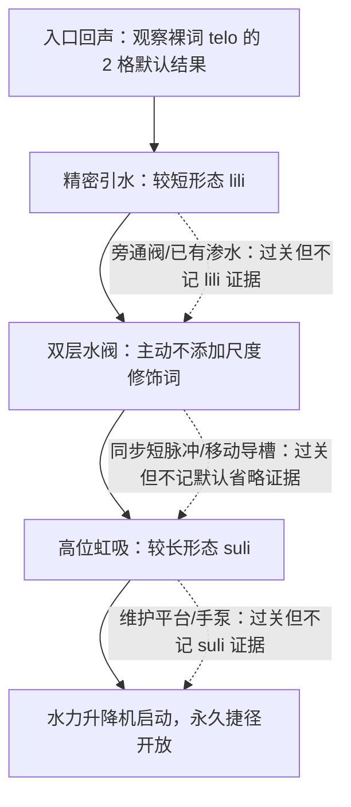

# L-01｜高位蓄水槽灰盒关卡

状态：灰盒规格 v0.1<br>
任务 ID：`ch01_length_cistern`<br>
依赖：G-01 v0.7、G-02 v0.5、W-01 v0.6、`chapter-01.4`、`g02.length-profiles.v0.1`<br>
范围：第一章首次完整对照 `telo lili / telo / telo suli`

## 1. 关卡职责

本关让玩家通过空间结果理解一件事：在当前轴向水元素框架中，`lili`、不添加尺度修饰词、`suli` 分别得到较短、默认、较长形态；三者不是弱、中、强，也不改变水柱截面、压力、速度或伤害。

关卡成功由蓄水槽和机关的世界状态决定，不检查唯一字符串。玩家可以通过法术、已有水源、机械工具或合理组合过关；只有实际展示目标语言能力的方案才产生对应学习证据。

## 2. 冻结参数

| 表达 | 本关形态 | 长度 | 截面 | 激活 MP | 本关独特价值 |
|---|---|---:|---:|---:|---|
| `telo lili` | 较短形态 | 1 格 | 12 px | 6 | 穿过低顶棚下的精密安全窗 |
| `telo` | 默认形态；不添加尺度修饰词 | 2 格 | 12 px | 5 | 一次形成校准盘需要的两格水量 |
| `telo suli` | 较长形态 | 4 格 | 12 px | 10 | 从低位锚点触及四格之外的高位入水口 |

1 格为 16 px。三种构形均零初速度；预览确认后生成，释放时受重力和流体规则影响。本关不开放宽度、整体大小、速度、伤害或持续时间调节。

## 3. 玩家前置与退出状态

进入前：

- 已在 `ch01_waterwheel` 中见过 `telo`，知道显化水会受重力；
- 独立预览使用 24/24 MP 快照；嵌入序章时继承地区存档中的当前 MP、最大 MP、表达容量和学习状态（预期此时最大 MP 为 26），不得用快照覆盖；
- `lili/suli` 可以处于“未发现”或“已见但未掌握”状态；
- 玩家仍可使用移动、近战和环境工具，但本关没有必须击败的敌人。

嵌入序章首次激活入口检查点时执行一次轻恢复：`restore = round_to_0.5(max(3, 0.15×max_mp))`，软上限为 `floor_to_0.5(0.8×max_mp)`，`post_mp = current_mp + max(0, min(restore, soft_cap-current_mp))`。该操作只增加或保持当前 MP，不会降低高于软上限的已有 MP；相同激活 ID 重放不再次回复。

完成后：

- `cistern.siphon_primed = true`；
- `valley.upper_channel = available`；
- 通往回流道的永久梯降下；旧矿道入口只在玩家回到聚落并观察持续后果后开放；
- 记录本关产生的长度选择证据，但不直接把任一词标成永久掌握。

## 4. 空间规格

灰盒使用 30×48 格（480×768 px）的竖向房间，原点在左下。移动路线为折返上升；坐标只作为首版实现基线，试玩后可调整，但三个物理窗口不得失去 1/2/4 格的排他关系。

| 区域 | 高度范围 | 核心作用 |
|---|---:|---|
| 入口回声与较短形态区 | `y=2..13` | 观察裸词默认结果，再用 1 格形态通过近端安全窗 |
| 默认形态区 | `y=14..25` | 主动省略尺度修饰词，命中两格接水口 |
| 较长形态区 | `y=26..39` | 用 4 格形态跨过回收沟触发高位虹吸 |
| 出口与永久捷径 | `y=40..47` | 乘水力升降机离开并保存世界变化 |

平台最窄不少于 3 格，攀爬井宽不少于 2 格，不设置精确跳跃。关键对象：

| 对象 ID | 位置/包围盒（格） | 初始状态 | 规则作用 |
|---|---|---|---|
| `spawn.entry` | `[1,2]..[2,5]` | active | 玩家入口 |
| `checkpoint.entry` | `(3.5,2)` | active | 独立预览保存 24 MP；嵌入序章继承当前 MP 并按首次激活轻恢复公式结算 |
| `echo.default` | `[2,3]..[10,8]` | active | 脚本演示裸词 2 格默认水段，不扣玩家 MP |
| `anchor.short` | `(6.5,7.75)` | active | 主轴向东 |
| `receiver.short` | `[7.20,7.75)×[6.75,7.15)` | empty | 收集至少 0.25 MU 后开启右梯井 |
| `baffle.short` | 距锚点 1.25 格 | protected | 默认至少需 1.5 格、较长至少需 2.5 格，二者不能静默截成短形态 |
| `gate.right_shaft` | `[26,29)×[13,14)` | closed | 较短形态区完成后永久开启 |
| `checkpoint.first_landing` | `(24.5,14)` | locked | 保存第一阶段状态 |
| `anchor.default` | `(22,19.75)` | locked | 主轴向西 |
| `receiver.default` | `[19.75,20.25)×[18.75,19.15)` | empty | 需要约两格水量且不能溢流 |
| `drain.near` | `[20.50,21.50)×[18.5,19.0)` | open | 较短水段落入此处，第一次可打开检修盖 |
| `backstop.default` | 距锚点 2.25 格 | protected | 较长形态最低需 2.5 格，不能静默截成默认形态 |
| `gate.left_shaft` | `[1,4)×[25,26)` | closed | 默认形态区完成后永久开启 |
| `checkpoint.second_landing` | `(4.5,26)` | locked | 保存第二阶段状态 |
| `anchor.long` | `(7,32)` | locked | 主轴向东 |
| `return_trench.long` | `[7.5,10.5)×[30.5,31.0)` | open | 较短/默认水段在此下坠回收 |
| `intake.siphon` | `[10.60,11.25)×[30.90,31.40)` | dry | 与锚点相距 3.5–4.25 格 |
| `cistern.main` | `[11.25,23.5)×[31.5,38.5)` | unprimed | 保存原有水；显化水只启动虹吸 |
| `lift.water_powered` | `[25.5,28)×[26,40)` | inactive | 虹吸启动后通往顶层 |
| `checkpoint.exit` | `(26.5,40)` | locked | 保存全关状态 |
| `exit.return_channel` | `[28,29)×[41,44)` | locked | 通往回流道的任务出口和永久捷径 |

所有危险边缘下方都有回收池或斜坡。闸门与升降机检测玩家碰撞体后停止，不能夹伤玩家。

## 5. 玩家流程



### 5.1 观察默认形态

入口旧法师回声演示裸词 `telo`：预览显示 2 格、12 px 和 5 MP，随后脚本生成不可导出、不可拾取的演示水并让其受重力落入回收盆。演示不消耗玩家 MP，也不授予 `default_is_unspecified`。

系统分三层反馈：

1. 语言：`telo` 唤起液体、水或湿物质等宽语义；
2. 本作解释：未添加尺度修饰词，因此采用 2 格默认构形；
3. 世界结果：生成的水受重力下坠。

### 5.2 较短形态通过安全窗

玩家在 `anchor.short` 使用 `telo lili`：1 格扫掠停在石质挡板前，释放后的水落入近端接水口并开启右梯井。

裸词或 `telo suli` 的预览会在 1.25 格处被阻挡。默认形态的实现比为 `1.25/2=0.625`，低于 0.75；较长形态低于 1.25，因此二者都禁止确认且不扣 MP。反馈必须是“当前空间无法形成所选形态”，不能反馈为语言错误。

替代路线：玩家可以进入检修沟打开旁通阀，用墙后已有渗水完成世界目标；任务继续，但不生成 `short.unprompted_selection`。

### 5.3 主动省略尺度修饰词

第二夹层保留上一阶段的表达历史，但不会自动填词。两格外的接水口要求一次世界事件收集至少 1.6 MU 且不触发溢流。

- `telo lili` 成功施放但落入近端废水篦，第一次会打开导槽检修盖；
- 裸词 `telo` 的两格末端正好进入接水口，打开左梯井；
- `telo suli` 在 2.25 格处受挡，低于较长形态 2.5 格最低实现长度，因此禁止确认且不扣 MP；
- 两次同步短脉冲、移动导槽或已有水也能完成世界谓词，但不会产生 `default_is_unspecified`。

只有玩家主动提交无尺度修饰词的单一 CastPlan、在 H0/H1 提示下满足接水口目标时，才记录默认省略证据。从失败表达修复为裸词只记录 `repair.default_omission`，之后仍需平行情境获得强证据。

### 5.4 较长形态启动高位虹吸

`anchor.long` 到虹吸口为 3.5–4.25 格。玩家用 `telo suli` 沿公开向东主轴生成固定 12 px 截面的四格水段；两条可见支撑肋任选其一提供 `+0.10` 稳定度，使预期稳定度从 0.65 达到 0.75。释放后远端水落入虹吸钟，继而释放水槽中原有水来驱动升降机。

较短和默认形态都可成功施放，但会落入回收沟；它们的失败是距离不足，不是语言错误。较长形态不获得额外压力、速度或伤害。

替代路线：首次默认水落入回收沟会升起维护踏板；玩家可降低虹吸钟、搬水桶或修复手泵。这些方案满足任务目标，但不生成 `long.unprompted_selection`。

### 5.5 三类通关路线

- **语言直达**：`telo lili → telo → telo suli`，总价 21 MP，初始 24 MP 足够完成，剩余 3 MP。
- **维修旁路**：旁通阀、移动导槽、维护平台和现场水完成目标；主线不锁死，但不授予对应语言证据。
- **失误—修复混合**：合法但不合适的水段打开环境修复入口，再用改变后的世界条件完成；记录修复或工程证据，不冒充首次独立长度选择。

检查点主要用于保存与试错，不是强制恢复门槛。玩家主动回到当前阶段快照时，任务局部水体和本阶段 MP 一并复原；最大 MP、已有学习证据、收藏和全局进度不回滚，也不能借此复制物质或 MP。

## 6. 提示与界面

每次确认前固定显示：

- 宽语言意义与“本世界长度解释”两个独立标签；
- `较短形态｜lili`、`默认形态｜不添加尺度修饰词` 或 `较长形态｜suli`；
- 主轴、锚点、最终长度、固定 12 px 截面；
- 总激活 MP、状态维持费、稳定区间、阻挡对象和释放后行为；
- “直接攻击：否”。

提示按本阶段独立淡出：

1. 重放环境轮廓和目标机关；
2. 提示需要比较“覆盖长度”；
3. 展示可能相关的 `lili/suli`，但不填入表达；
4. 并列展示两个部分表达及其预览；
5. 给出完整示例，然后要求在新的机关状态上重新选择。

不得出现“水太弱”“升级到长水柱”“标准 toki pona 长度”“答对”等文案。

## 7. 学习证据

| 证据 ID | 触发条件 | 本关最多贡献 |
|---|---|---:|
| `length.default_baseline_observed` | 完成观察盆，看到语言/解释/物理三层反馈 | 1 |
| `length.short.unprompted_selection` | 提示等级不高于 1，单一 CastPlan 用较短形态填杯且未接触保护区 | 1 |
| `length.default_is_unspecified` | 提示等级不高于 1，裸词单一 CastPlan 满足校准盘且无溢流 | 1 |
| `length.long.unprompted_selection` | 提示等级不高于 1，较长形态直接触发高位入水口 | 1 |
| `length.counterfactual_explanation` | 玩家能从三个预览中指出另外两档的物理结果，而非说它们语言错误 | 1 |
| `length.repair_after_mismatch` | 一次距离/空间不匹配后换成合适形态完成 | 1 |

本关只能让证据进入 `available`，不能独立完成永久 `mastered`。后续还需要不同任务家族、跨元素未见迁移、宽语义对照和被其他探索内容隔开的延迟平行任务。

熟练玩家可在入口选择“静默校准”：系统随机交换三个机关的非关键位置，撤除词语高亮与逐步提示。玩家无提示完成三种物理目标并通过一个宽语义反事实选择后，可以跳过教学门，但仍按相同世界谓词和证据规则结算。

## 8. 状态、柔性失败与防软锁

- 解析失败、上下文不足、空间阻挡、距离不足、质量不足和溢流分别使用不同 `feedback_code`；
- 不合法预览和 MP 不足不扣 MP；
- 合法但无助于当前机关的施法可以消耗 MP，但玩家可重置到本阶段公开快照；
- 重置不清除已记录证据，不改变最大 MP，不要求现实等待；
- 任何阶段都可通过维护工具路线继续主线；
- NPC、显化物或移动箱体不得永久堵住锚点、梯子和重置面板；
- 对生物安全体积的扫掠始终禁止，关卡脚本不能覆盖该规则。

## 9. 遥测

除共享任务事件外记录：

```text
length_preview_opened
length_class_selected
length_preview_blocked
cast_confirm_rejected
length_cast_released
station_world_predicate_changed
stage_reset_requested
alternate_method_used
counterfactual_submitted
length_evidence_recorded
```

每条事件至少附带：

```text
task_id / task_version / scene_snapshot_id
ruleset_version / lexicon_content_version / length_profile_version
stage_id / attempt_id / prompt_level
normalized_semantic_plan / length_class / final_length_tiles
activation_mp_required / activation_mp_paid
blocking_object_id / interpretation_status / feedback_code
goal_predicate_results / evidence_ids
```

不得把原始自由文本默认上传；研究日志优先保存规范化计划、结果和经同意的匿名标记。

## 10. 已知、已知未知与未知未知

已知且冻结：

- 三档为 1/2/4 格，截面固定，长档不增伤；
- 任务成功与学习证据分离；
- 无现实计时器、打卡或重复施法解锁；
- MP 不足不静默降档，环境截断遵守每档最小实现比。

已知未知：

- 12 px 水柱在实际像素缩放下能否清楚显示 1/2/4 格差别；
- 玩家是否会把校准盘理解成单纯重量谜题，而忽略“默认＝未修饰”；
- 合法但失败的施法消耗与阶段重置是否足够宽容；
- 向上生成后立即受重力的长水柱是否视觉上像错误或延迟；
- 工具替代路线应多早显露，才不会抢走首次主动检索。

未知未知监测：

- 玩家是否发现通过帧同步、碰撞边缘或移动物体绕过长度判定；
- 玩家是否因颜色、音效或按钮位置误把三档排成强度等级；
- 道本语熟练者是否拒绝本作把当前组合解释为轴向长度；
- 玩家是否用反复重置规避 MP 决策或制造异常证据；
- 辅助功能、低分辨率或高延迟输入是否改变预览与实际碰撞的一致性。

## 11. 灰盒验收

- [ ] 30×48 格竖向房间从入口到出口可在不战斗、无需精确跳跃的情况下完成。
- [ ] 三种水构形均保持 12 px 截面、零初速度和非攻击属性。
- [ ] 较短、默认、较长至少各有一个只有该档能直接满足的空间/质量目标。
- [ ] 关卡完成只读取世界谓词，不读取原始输入字符串。
- [ ] 替代路线能继续主线，但不会冒充对应语言证据。
- [ ] 默认形态证据只在玩家主动省略尺度修饰词时记录。
- [ ] 环境阻挡低于目标档最小实现比时禁止确认且不扣 MP。
- [ ] MP 不足显示所需值，不静默截短或换档。
- [ ] 阶段重置能恢复可达状态，不回滚既有学习证据。
- [ ] 预览、渲染和碰撞端点误差不超过 1 px。
- [ ] 任意有效路径都不会把 `lili/suli` 教成缩短/延长动作或弱/强按钮。
- [ ] 一次通关不能把长度三档直接标为永久掌握。
