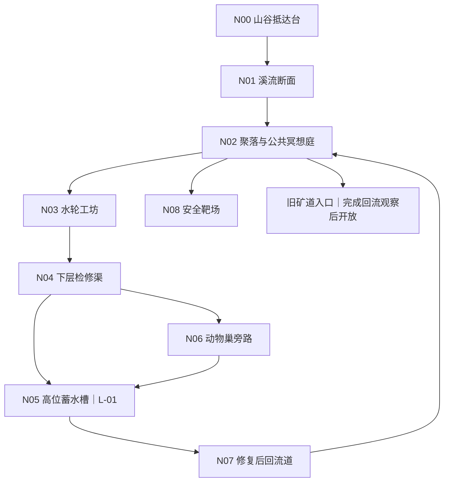

# LP-01｜溪谷世界识读序章灰盒

状态：跨场景灰盒规格 v0.1<br>
章节编排 ID：`ch01_world_literacy_prologue`<br>
依赖：G-01 v0.7、G-02 v0.5、W-01 v0.6、L-01 v0.1<br>
范围：典型玩家约前三小时；以世界识读为主，正式战斗不构成主循环

## 1. 序章职责

本序章让玩家先学会观察这个世界，再学会有意识地改变它。结束时，玩家应当理解：

1. 显化物和自然物服从同一套重力、温度、材料与路径规则；
2. 魔法能够创造有限的基本物质或能量，但利用环境通常更省 MP；
3. 聚落、基础设施、职业与贫富差异都建立在物质条件之上；
4. 普通动物具有警戒、巢穴与逃生需求，不是默认敌人或经验包；
5. 破坏能够解决问题，也会形成需要承担的持续后果；
6. 道本语表达决定动作关系，MP 与环境决定规模、持续和物理结果。

“三小时”只用于内容预算与试玩统计，不是倒计时、锁定时长或奖励条件。自由探索、暂停和挂机时间单列；玩家可以长期停留或和平进入后续地区。

## 2. 核心体验循环

```text
抵达地标
→ 观察异常与当地生活
→ 用环境、工具或语言尝试
→ 看见即时物理结果
→ 看见设施、人物和生态的持续变化
→ 从新路线回访旧地点
```

序章内容预算暂定为：

- 约 70%：探索、人物、材料操作与基础设施；
- 约 20%：主动表达、结果预测、改述与未见迁移；
- 约 10%：冥想、因果回顾和安全靶场；
- 每 15–20 分钟内容预算至少一次有持续后果的选择；
- 每 30–40 分钟内容预算至少一次主动语言取回；
- 连续不超过两次同类练习；每个节段同时聚焦的主动新词不超过 2 个。

## 3. 地区拓扑



地图采用 16 px 世界格与左下坐标原点；相机使用独立的竖屏滚动配置，不能把场景尺寸绑定为当前实验室的 `270×480` 画布。房间大于屏幕时滚动显示。

| 节点 | 建议尺寸 | 世界识读职责 | 必须保留的路线 | 主要持久变化 |
|---|---:|---|---|---|
| `N00 arrival_shelf` | 24×20 格 | 松石、湿土与朽木都可改变 | 自然缓坡或浅水绕行 | 玩家修出的踏脚点 |
| `N01 stream_section` | 32×24 格 | 水受坡度、容器和土壤影响 | 不依赖施法的河岸路线 | `arrival_route_stabilized` |
| `N02 settlement` | 40×30 格 | 材料选择体现公共水权、维修能力和生活差异 | 聚落主街 | NPC 路线、灯光与工坊状态 |
| `N03 waterwheel` | 30×32 格 | 现有水比显化水省 MP；结构决定持续效果 | 维修轴或移动导槽 | `waterwheel_restored` |
| `N04 service_channel` | 28×40 格 | 水、泥、石、木和薄冰具有不同状态后果 | 公开维修旁路 | `service_gate_open` 或 `service_bypass_open` |
| `N05 high_cistern` | 30×48 格 | 引用 L-01 的 1/2/4 格长度对照 | 阀门、导槽、平台和手泵旁路 | 沿用 L-01 三个完成旗标 |
| `N06 den_bypass` | 28×28 格 | 观察警告、退让、绕行和非致命驱赶 | 上方挖掘或等待路线 | `fox_den_intact`、`den_route_open` |
| `N07 return_channel` | 30×26 格 | 回看玩家此前行为的连续后果 | 旧溢流槽 | `wet_meadow_restored`、聚落供水等级 |
| `N08 safe_range` | 24×18 格 | 攻击签名只在无生命靶标上验证 | 可跳过，不阻挡地区推进 | `first_attack_signature_available/completed` |

所有主线路段至少保留一条不依赖法术、不依赖击杀、不会被普通材料破坏永久封死的维修或绕行路线。

## 4. 典型三小时节拍

| 内容预算 | 阶段 | 主要目标 | 世界与语言作用 |
|---|---|---|---|
| 0–25 分钟 | 抵达溪谷 | 到达聚落安全点 | 观察水、坡度、松石与朽木；首次主动使用 `telo`，看见显化水零初速度下坠 |
| 25–50 分钟 | 聚落识读 | 激活冥想庭并选择一项居民委托 | 认识公共设施、金币来源、工具旁路和“来源—目标—路径—副作用”安全文化 |
| 50–85 分钟 | 停转水轮 | 令水轮稳定转动且下游不过载 | 清堵、修轴、移动导槽、利用自然水或短时显化；短时成功与持续修复产生不同回访结果 |
| 85–115 分钟 | 下层检修渠 | 打开至少一个检修出口 | 用挖掘、搬运、融化、阀门或绕行理解材料状态；在非战斗目标中接触 `tawa` 与 `o` 结构 |
| 110–150 分钟 | 高位蓄水槽 | 引用 L-01 完成蓄水与虹吸 | 仅对实际观察或尝试的 `lili/suli` 提交 `available` 提案；纯工具路线不伪造词状态 |
| 140–165 分钟 | 巢区与回流 | 恢复自然供水并回到聚落 | 狐狸、兔子和蝙蝠作为生态与危险反馈；`wawa` 只在无生命回流机关上首次计证据 |
| 155–180 分钟 | 回访与安全靶场 | 观察世界改变；可取得靶场许可并尝试正式解锁 | P90 在 180 分钟内容预算内取得试炼许可；正式解锁不阻挡和平推进 |

时间窗允许重叠，因为玩家可以在检修渠、巢旁路和蓄水槽之间往返。不得用现实时间自动授予或拒绝任何语言能力。

## 5. 任务与多解契约

### 5.1 抵达与聚落

玩家可以移动松石、搭朽木、挖软土、走浅水或绕上坡抵达聚落。`telo` 旁边必须同时出现浅盆和旧导水槽，使玩家看见“创造了水”不等于“控制了水”。

早期经济来自修补、运输、测绘、回收和采集，不来自击杀。首批可购买或借用的物品是绳索、提灯燃料、铲、维修锤、包扎物和木杖；木杖首先是探路、推物与紧急自卫工具。

### 5.2 水轮

水轮目标谓词只检查稳定转动和下游安全，不检查输入字符串。至少提供：

- 移开堵塞石块并导入已有溪水；
- 修理轴承或重新固定木槽；
- 挖开软土形成旁侧水路；
- 用显化水短暂驱动后完成机械锁定；
- 等待上游蓄水并调整闸门。

只靠短时显化会让水轮再次停下；修好结构则改变灯光、升降台、居民路线和苔藓状态。两种结果都是真实世界结果，不把前者判为“错误答案”。

### 5.3 检修渠与蓄水槽

检修渠一次只引入一个新的材料反应、语言项目或动物行为。合法但无助于目标的施法保留物理结果；局部必须在 60 秒内提供继续、修复或公开重置路径。

蓄水槽完整引用 [L-01](ch01-length-cistern-graybox-zh.md) 与其任务 YAML，不复制内部机关、数值或证据。L-01 结束时 `lili/suli` 只能进入 `available`；完整跨材料巩固延后，不能作为首个攻击资格的必要前置。

### 5.4 动物巢与自卫

普通动物状态遵循：

```text
平静 → 观察 → 警告 → 短暂自卫 → 逃跑 → 返回
```

- 兔子和狐狸默认逃避玩家；狐狸只在巢穴、幼崽或退路受威胁时警告和短暂冲撞；
- 动物不会形成必须清除的门锁，不授予语言经验、重要掉落、钥匙或高额金币；
- 可等待、绕行、制造声音、使用低强度推力、放置食物或挖掘其他路线；
- 第一次动物接触发生在玩家已经理解安全点、撤退和环境操作之后；
- 武器只保证被逼入角落时的应急自卫，不把普通动物包装为战斗教学对象。

动物还承担环境反馈：蝙蝠提前感知结构振动，青蛙随水位迁移，兔子重新进入恢复的草地，狐狸在巢穴保留时回到水边。

可执行动物实体、警戒区、真实逃生出口、回归条件、无收益伤害契约和幂等事件见 [`data/ecology/valley-prologue.v0.1.yaml`](../../../data/ecology/valley-prologue.v0.1.yaml)。

### 5.5 安全靶场

首个攻击候选签名为 `attack.water.forceful_motion.v0.1`；`telo o tawa wawa` 只是该规范化语义图的一个非唯一示例。系统不得比较原始字符串。

机器定义见 [`data/spells/attack-signatures.v0.1.yaml`](../../../data/spells/attack-signatures.v0.1.yaml)，其中冻结 MP 报价、MU/EU 动能输入、物相伤害分量、安全范围和证据图。

靶场采用三阶段资格，避免同一事件既要求又创造 EC4 的循环：

1. **能力校准**：`telo` 在两个任务家族 H0/H1 主动取回；`N o tawa` 在两个非战斗任务家族使用；`wawa` 只在无生命回流机关上产生一次 H0/H1 证据；完成一次相关表达修复和一次被两个无关世界事件隔开的延迟取回。证据图完成后，`attack_capacity_calibrated` 才把表达容量、法器槽位和最大 MP 提交为 4、4、30。
2. **靶场试炼许可**：`attack_prerequisites_verified` 只读取已提交的能力校准和 `prologue_return_observed`，不得在同一事件中创造其前置容量；通过后只在安全靶场临时允许该签名作用于无生命目标。
3. **正式签名解锁**：玩家完成一次 H0/H1 未见迁移后，才写入全局 `first_attack_signature_available`。

表达容量来自有效证据包和法器校准，不由最大 MP 或现实时间自动赠送；未达到容量时，下一安全点提供平行的非战斗校准情境。

靶场使用木靶、沙袋、矿车、悬挂石块和材料碰撞表。表达本身只建立有力运动；伤害仍由质量、相对速度、材料耦合和碰撞结果产生。

未获得试炼许可或未完成正式解锁时，玩家都可以和平进入旧矿道入口；低危险动物始终可用工具、撤退和环境方式处理。

### 5.6 软生存与动物素材经济

饱食度与口渴度采用长周期、非致死设计。暂停、对话、冥想、组词界面和 L-01 不结算代谢；聚落加工仍推进单调世界时钟和工时，但安全区冻结需求消耗。返回观察提交前最低为 20，随后通过幂等事件永久解除下限；需求不能影响 MP、表达容量、语言证据、解析或法术伤害。聚落提供公共水井、植物餐、厨房、屠宰台与制革坊，玩家无需狩猎即可维持需求。

杀死成年动物会生成唯一且会腐败的尸体，而不是直接爆出金币、肉或皮。兔子可处理出小型肉与小皮，狐狸提供少量低价肉和中型毛皮，蝙蝠与泥蛙只提供少量肉。采集、烹饪、风干、鞣制和售卖均保留来源链并通过跨存档事务防止复制；它们不产生语言成长、EC、MP、攻击资格或任务钥匙。

猎获是可选副收入，单位时间收益上限为维修、运输、测绘等非暴力工作的 60%。皮革与食物都有购买、植物、旧料和公共援助替代；商人不会在前三小时发布狩猎任务。完整规则见[软生存与动物素材经济](../gameplay/03-survival-and-wildlife-economy-zh.md)、[需求数据](../../../data/player/survival-needs.v0.1.yaml)、[动物加工市场数据](../../../data/economy/wildlife-products.v0.1.yaml)和[跨存档 WAL](../../../data/persistence/cross-save-wal.v0.1.yaml)。

## 6. 世界识读与语言证据

世界识读不等于看过面板。每项核心认识至少需要“观察”和“介入”两类证据；需要进入成长判断时，再补一次迁移或因果解释。

| 证据 ID | 玩家应理解 | 有效证据示例 |
|---|---|---|
| `world.water_obeys_path` | 水受重力、坡度和容器影响 | 观察下坠；随后改变沟槽令水到达新位置 |
| `world.environment_saves_mp` | 利用现成物通常比显化便宜 | 用自然水完成持续水轮，或解释短时显化为何不能替代修复 |
| `world.heat_needs_source` | 燃烧、融化和持续热需要能量来源 | 观察薄冰/湿木；选择燃料或持续投入 |
| `world.length_is_geometry` | `lili/suli` 改轴向长度，不直接改单位强度 | L-01 对照后正确预测另一材料结果 |
| `world.wildlife_has_intent` | 普通动物会警告、退让和逃生 | 看懂警告后退、绕行或非致命驱赶 |
| `world.destruction_persists` | 破坏改变路线、设施和居民生活 | 回访自己挖开的旁路、冲毁的泥岸或修好的结构 |

工具路线可以完成世界目标，但不能伪造目标语言证据；语言路线也不能绕过能量、材料和安全规则。

## 7. 失败保护

- 不可解析、歧义、非法预览和 MP 不足不扣 MP；
- 合法但任务无效的施法保留物理后果，同时公开局部恢复或重置方式；
- 休息和自然恢复当前 MP 不要求答题；冥想恢复也不能以答错为由拒绝基础恢复；
- 重置不回滚已记录证据，不复制 MP、材料或任务物品；
- NPC 沟通失败允许澄清，不永久降低关系或锁住主线；
- 关键承重结构可以受损，但必须存在维修、绕行或检查点恢复，不允许细粒破坏造成永久软锁；
- 工具旁路允许剧情前进，但只记录工程/探索证据；
- 攻击未解锁不阻挡地区推进，也不迫使玩家反复刷同一机关。

## 8. 回流变化矩阵

| 早先行为 | 回访画面 | 持续后果 |
|---|---|---|
| 修好自然水路 | 水轮持续转动、灯带点亮 | 工坊重新开放 |
| 只靠短时显化 | 水轮再次停止 | NPC 指出结构仍待修复，并保留维修任务 |
| 挖开安全旁路 | 居民加固新通道 | 形成永久检修捷径 |
| 冲毁泥岸 | 低地水体浑浊 | 开启修岸补救，不锁主线 |
| 保留狐狸巢 | 狐狸从远处饮水 | 巢旁路线保持克制通行 |
| 恢复湿地供水 | 草、青蛙和兔子返回 | 主要是生态反馈，不生产稀有资源 |
| 过度破坏聚落 | 出现支撑、封条和 NPC 改道 | 形成后续维修需求而非抽象道德扣分 |

只持久保存对路线、设施、生态和叙事有意义的差分；普通粒子、水滴和短时显化物按场景或检查点生命周期处理。

## 9. 试玩验收

| ID | 验收目标 | 暂定阈值 |
|---|---|---|
| `PA-01` | 探索、人物和物理操作占主导 | 非语言 UI 内容时间不少于 65% |
| `PA-02` | 主动语言不会挤压世界体验 | 组词、预测和改述约 15–25%；长说明面板不超过 10% |
| `PA-03` | 有持续后果的选择 | 每 20 分钟内容预算至少一次 |
| `PA-04` | 主动取回有间隔 | 每 30–40 分钟至少一次，连续同类不超过两次 |
| `PA-05` | 攻击资格位置 | 主路径新手中位约 180 分钟；不使用现实时间门 |
| `PA-06` | 战斗边界 | 主线必须击杀数为 0；安全靶场不使用动物 |
| `LE-01` | 核心词主动取回 | 至少两个词能在不同情境以 H0/H1 完成 |
| `LE-02` | 因果归因 | 玩家能解释一次施法中语言、MP 与自然规律各自贡献 |
| `LE-03` | 未见迁移 | 至少一个结构跨实验任务与实际委托使用 |
| `LE-04` | 去线索能力 | 撤除固定槽位、颜色和图标后仍能重建主要表达 |
| `FP-01` | 柔性失败可恢复 | 任何必经柔性失败后 60 秒内存在继续、修复或公开重置路径 |
| `FP-02` | 动物不成为资源敌人 | 关键路径动物击杀为 0，击杀不产生必要收益 |

关键事件：

```text
prologue_segment_started
prologue_segment_completed
world_literacy_observed
world_literacy_intervened
causal_attribution_submitted
active_retrieval_submitted
repair_requested
repair_completed
unseen_transfer_completed
delayed_retrieval_completed
alternate_method_used
wildlife_encountered
wildlife_provoked
wildlife_fled
wildlife_harmed
local_reset_requested
local_reset_completed
attack_qualification_started
attack_qualification_completed
safe_range_completed
```

## 10. 已知未知与异常监测

已知未知：

- 约三小时内同时接触世界、长度和首个攻击资格是否仍然过载；
- 玩家是否能从细粒物理中分辨“词语贡献”和“自然规律贡献”；
- 无击杀序章是否保持足够张力，哪些基础设施事故可以替代敌人压力；
- 工具旁路会不会使部分玩家永久跳过主动语言取回；
- 不同初始种族的质量、浮力和耐热差异是否改变必经路线难度；
- 现有 24 MP 是否为每个新概念提供足够的试错空间；
- 狐狸、兔子和可破坏巢穴是否会被玩家视为资源而非生态；
- 中位约 180 分钟的靶场目标与自由探索之间如何区分统计口径。

未知的未知重点监测：

- 玩家主动猎杀无奖励动物，或利用动物身体绕过机关；
- 用 `seli` 烧穿全部早期路径，让语言与环境任务失去差异；
- 只记住法术槽位置、颜色或手势，没有记住词和结构；
- 借重置、材料分裂、显化物出售或存档重放复制 MP 与资源；
- 低帧率或不同设备令物理结果、任务谓词和学习证据分叉；
- 可破坏材料使叙事 NPC、入口或安全提示永久不可达；
- 本作的魔法约定被玩家或社群误认为道本语的固定词义。

## 11. 完成定义

序章在以下条件同时满足时可进入下一轮灰盒：

- [ ] 必经闭环为抵达台→溪流→聚落→水轮→检修渠→蓄水槽→回流道→聚落；巢旁路与安全靶场可选，旧矿道入口不依赖攻击解锁；
- [ ] 每个必做世界目标都有环境、工具或语言中的至少两类解法；
- [ ] 主线必须击杀数为 0，普通动物没有重要掉落和语言奖励；
- [ ] L-01 仍是长度数值和机关的唯一权威来源；
- [ ] 世界结果只检查状态谓词，不比较唯一输入字符串；
- [ ] 破坏后存在维修、绕行或公开重置，不会永久软锁；
- [ ] 安全靶场只验证表达、物理预算和材料碰撞，不强制真实战斗；
- [ ] 攻击未解锁时仍可和平进入后续地区；
- [ ] 试玩能分别统计内容预算、自由探索、暂停和挂机时间。
